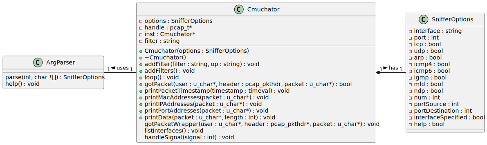
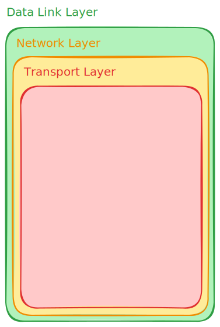
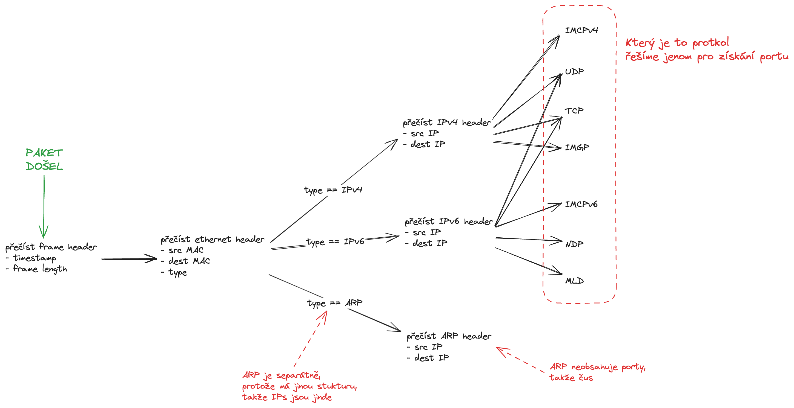
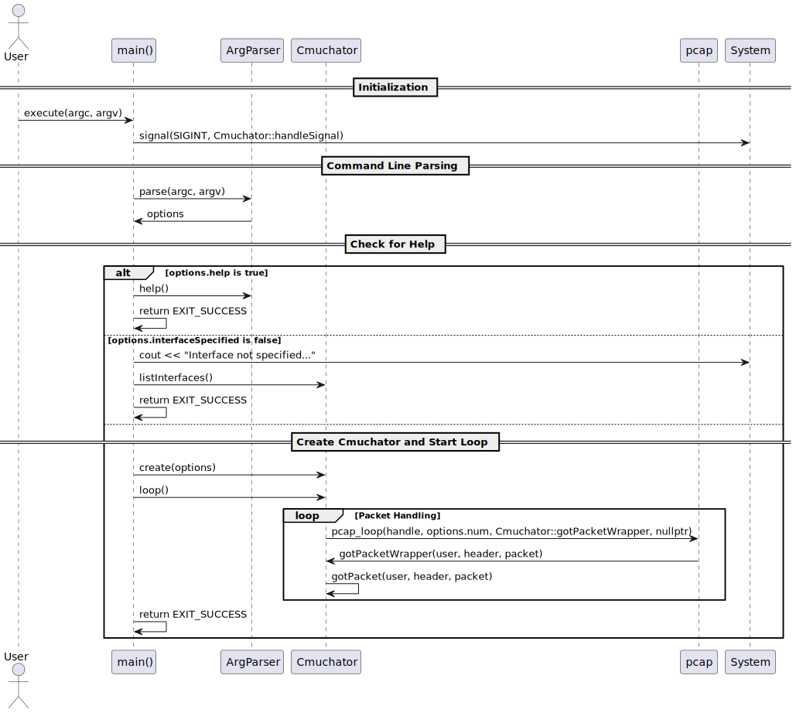
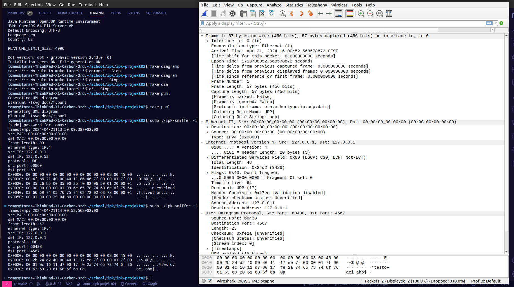

# IPK projekt 02 - 2023/24 - zadání ZETA

Autor: **Tomáš Hobza** (`xhobza03`)

**2024 @ FIT VUT**

---

## 👋 Úvod

Tato dokumentace popisuje moji implementace druhého projektu z předmětu IPK. Projekt představuje síťového "čmuchala," který přijímá síťové pakety dle uživatelem daných filtrů a analyzuje jejich obsah.

Projekt jsem realizovat objektově-orientovaným přístupem a to spíše pro přehlednost. Kód je z pohledu struktury vcelku jednoduchý, tudíž se v něm nevyskytuje pokročilá práce s třídami. Všechny třídy jsou "jedináčci" převážné kvůli principu zapouzdření vnitřního stavu.

Pro jednodušší orientaci jsem vytvořil diagram vztahu mezi třídami mé implementace.

*Popisek: Diagram vztahu mezi třídami celého projektu*

## 📚 Teorie

V této kapitole budu čerpat z několika zdrojů. Teorii, kterou zde popisuji jsem zjistil právě na těchto zdrojích, ovšem následující text je čistě mojí interpretací. [1] [2] [3] [4] [5]

Před popisem struktury mého projektu je důležité popsat teorii, kterou je třeba znát pro tvorbu tohoto projektu. Struktura mého projektu je odvozena právě od této teorie.

Program zachytává pakety a vypisuje relevantní data z jejich těla. Je proto důležité správně pochopit jak tělo paketu analyzovat.

Paket obecně nemá jednu specifickou strukturu. Jeho struktura je totiž závislá na použitých protokolech v jednotlivých vrstvách modelu ISO/OSI. Pro tento projekt jsou relevantní jenom vrstvy linková (*obsahující fyzické adresy*), síťová (*obsahující logické adresy*) a transportní (*obsahující například porty*). Pro každou vrstvu se k datům z vrstvy vyšší přidávají data navíc (*většinou na začátek*) obsahující informace důležité pro práci na dané úrovni.

Paket si lze tedy představit například takto:

*Popisek: Vizualizace struktury paketu*

Knihovna, kterou máme na projekt použít (`libpcap`) ovšem vrací paket jako "buffer" - tedy posloupnost bajtů. Jednotlivé hlavičky je třeba z něj přečíst manuálně. Pro pakety neexistuje jedna obecná šablona kvůli různým délkám hlaviček - dekompozice paketu je pak závislá na použitých protokolech, jak jsem již zmínil, a proto ona dekompozice tvoří jakýsi strom, kde uzly reprezentují dané protokoly, kterým procházím, abych se dostal k potřebným datům o paketu.

*Popisek: Vizualizace stromu dekompozice paketu*

## 🧠 Hlavní logika programu

 

*Popisek: Sekvenční diagram zachycující hlavní logiku programu*

### 📄 Čtení argumentů programu

Pro čtení argumentů, které dostal samotný program od uživatele a jejich uložení jsem vytvořil třídu `ArgParser`. Její úkol je vcelku prostý a její fungování též - používá funkci `getopt_long`, které nejprve předá strukturu popisující jaké argumenty má číst a jejich atributy a následně tyto argumenty čte a jejich atributy ukládá.

Program pak v hlavní funkci zkontroluje:

1. pokud by předán argument z `-h` - dojde k výpisu použití programu
2. pokud nebylo zadáno rozhraní pro čtení paketů (`-i|--interface`), je vypsán seznam dostupných rozhraní

### 🔌 Inicializace zařízení pro čtení paketů

Samotné čtení a analýzu paketů provádí třída `Cmuchator`. Té je při instancializaci předána struktura s argumenty programu na základě které vytvoří zařízení pro čtení paketů.

Následně je vytvořen textový řetězec reprezentující filtr pro knihovnu `libpcap`. Jeho vytvoření je vcelku prosté - dané argumenty specifikují množinu paketů, které má program zachycovat. Komplexnější byli pouze filtry portů, které jsou závislé na jiných filtrech, což bylo nutné realizovat při skládání onoho řetězce s filtrem.

Filtrovací řetězec je následně zkompilován a nastaven otevřenému zařízení pro čtení paketů.

### 🔄 Hlavní čtecí smyčka

Knihovna `libpcap` nabízí funkci, která přečte daný počet paketů a pro každý zavolá danou funkci. Třída `Cmuchator` je "jedináček," což vychází z logiky kódu. Bylo ovšem třeba tento návrh realizovat úplně, jelikož funkce `pcap_loop()` bere jako argument funkci, kterou volá pro každý přijatý paket. Aby to bylo možné je třeba přidat třídní metodu, která funguje jako "wrapper" a na instanci třídy `Cmuchator` zavolá odpovídající metodu na zpracování paketu.

Zpracování paketu pak probíhá v těchto krocích:

1. výpis `timestamp` paketu

2. výpis fyzických adres paketu

3. výpis délky paketu

4. výpis logických adres paketu

   1. pro `IPv4` paket
   2. pro `IPv6` paket
   3. pro `ARP` paket

5. výpis portů paketu

   1. pro `IPv4` paket

      1. pro `TCP` paket
      2. pro `UDP` paket

      *(protokoly `ICMP` a `IGMP` porty neobsahují)*

   2. pro `IPv6` paket

      1. pro `TCP` paket
      2. pro `UDP` paket

      *(protokol `ICMPv6` porty neobsahuje)*

   *(protokol `ARP` porty neobsahuje)*

6. výpis bajtů paketu v hexadecimálním a ASCII formátu

## 🧪 Testování

Praktické testování tohoto projektu jsem prováděl současným spuštěním aplikace Wireshark. Fungování a výstup obou aplikací jsou si totiž velmi podobné. 

*Popisek: Testování porovnáním s aplikací Wireshark*

Zde na obrázku je příklad testu. Pomocí aplikace jsem si na rozhraní "loopback" poslal jeden UDP paket s textem "testovaci ahoj." Z obrázku je zřejmé, že můj program správně přečetl data paketu a ty následně vypsal.

Manuální testování je ovšem neefektivní pro širší testování, tudíž jsem se rozhodl využít automatické testy od pana kolegy `xjerab28`. Jeho testovací skript jsem rozšířil o více testovacích scénářů. Dobrým příkladem mého rozšíření je přidání neseparovaných testů. Originální testy pro každý scénář testovaly pouze poslání očekávaného paketu, což testuje pouze správnost výpisu. 

Pro testování fungování filtrů jsem tedy vytvořil testy, které pošlou více paketů jiných typů. V testu je pak kontrolováno kolik paketů a jaké pakety byly programem zpracovány.

## 📖 Literatura

- [1] **Martìn Casado**. 2001. "The Sniffer's Guide to Raw Traffic". http://yuba.stanford.edu/~casado/pcap/section1.html

- [2] **Tim Carstens**. 2002. "Programming with pcap". https://www.tcpdump.org/pcap.html
- [3] "Transport layer". https://www.tcpdump.org/pcap.html
- [4] "Data link layer". https://en.wikipedia.org/wiki/Data_link_layer
- [5] "Network layer". https://en.wikipedia.org/wiki/Network_layer